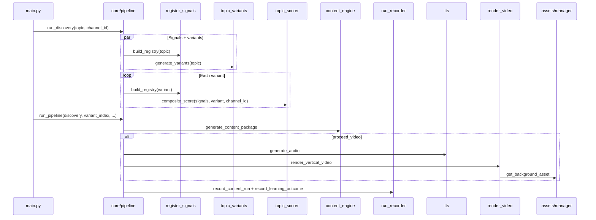

# Content OS — Architecture

## Folder structure

```
content_machine/
├── main.py                 # CLI entry (startup banner + optional mascot)
├── README.md
├── requirements.txt
├── .env.example
├── alembic.ini
├── ROADMAP.md              # Pointer → docs/roadmap.md
│
├── alembic/                # Schema migrations (0001 baseline → 0004 content_run FKs)
├── config/
│   ├── channels.json       # Channel profiles
│   ├── paths.py            # data/, secrets/, cache paths
│   ├── settings.py
│   ├── data_sources.json
│   └── secrets/            # OAuth files (gitignored)
├── core/
│   ├── pipeline.py
│   ├── content_engine.py   # LLM content package
│   ├── ascii_art.py        # CM banner + Luffy mascot panel
│   ├── data/luffy_ascii.txt
│   ├── tts.py
│   └── ui.py
├── apis/                   # Signals, scoring, cache (mma_stats, ufc_context, scrapers)
├── assets/                 # Providers, hybrid composite, catalog, thumbnails
├── analytics/              # Metrics sync, post timing, TapIn seed
├── publishing/             # YouTube publisher, repurpose scaffold
├── jobs/                   # Background worker (upload/render jobs)
├── scripts/                # ops, queue_manage, requeue_upload, daily_sync, status
├── sports/                 # ESPN scoreboard (live_scores signal)
├── storage/                # SQLAlchemy models, DB, repositories, Alembic runner
├── video/                  # render_video, subtitles; backgrounds/ for local clips
├── youtube/                # OAuth, upload, thumbnails, check_setup
├── tests/
│
├── data/                   # JSON runtime (gitignored): cache, memory, jobs
├── output/{channel}/       # Per-channel audio, video, thumbnails (gitignored)
└── assets/cache/           # Downloaded stock clips (gitignored)
```

### Repository tree (source only)

Runtime caches (`data/`, `output/`, `assets/cache/`, `.venv/`) are omitted below.

```
content_machine/
├── main.py
├── README.md · ROADMAP.md · requirements.txt · alembic.ini · .env.example
├── .github/workflows/ci.yml
│
├── alembic/versions/          # 0001_baseline → 0004_content_run_fks
├── analytics/                 # metrics, queue, SEO refresh, competitor sync
├── apis/                      # signals, scoring, scrapers/
├── assets/                    # providers, composite, thumbnails, flux
├── config/                    # channels, secrets/, seo/, competitors/
├── core/                      # pipeline, UI, ascii_art, data/luffy_ascii.txt
├── docs/                      # architecture, roadmap, debugging, …
├── jobs/worker.py
├── publishing/                # youtube_publisher, repurpose scaffold
├── scripts/                   # ops, queue_manage, requeue_upload, status, …
├── sports/espn.py             # live_scores scoreboard
├── storage/                   # models, repositories/, alembic_runner
├── tests/                     # 1,433+ tests (unittest discover)
├── video/                     # render, subtitles, backgrounds/, intro/
└── youtube/                   # oauth, upload, thumbnails, check_setup
```

## Product split

The repo serves two products:

1. **Intelligence layer** — signals, scoring, brief, competitor pulse → `core/intelligence_report.py` (Markdown/JSON). No video required. See [positioning.md](positioning.md).
2. **Production tail** — script, TTS, render, upload (TapIn operator path). Gated by `CONTENT_MODE` (set `intelligence` to skip warmup/upload assumptions in `main.py`).

## Core modules

| Module | Responsibility |
|--------|----------------|
| `core/intelligence_report.py` | Content Intelligence Report from discovery + brief + competitors |
| `core/pipeline.py` | `run_discovery`, `run_pipeline`, `run_media_only`; orchestrates end-to-end flow |
| `core/content_engine.py` | LLM title/script/description (JSON mode, UFC facts, `script_brief`); calls via `llm_router` |
| `core/script_brief.py` | Topic/channel brief matrix (UFC weight class, event accuracy) |
| `core/run_recorder.py` | Persists `content_runs`, calls learning outcome recording |
| `core/ui.py` | CLI sections, signal health, variant display |
| `core/logging.py` | Centralized log setup |
| `core/llm_router.py` | **Multi-provider LLM router** — task tiers (cheap/extract/premium) across DeepSeek/OpenRouter/Ollama/OpenAI/Claude; per-provider token ledger; OpenAI-style image content-blocks (Anthropic/DeepSeek/Ollama skipped, not flattened). All runtime LLM calls route here. `core/llm_client.py` is gone |
| `core/authenticity.py` | 2026-policy variation / insight / substance check; content-word cosine paraphrase arm (`AUTHENTICITY_SEMANTIC`) |
| `core/run_mode.py` | Standard vs Free ($0) cost mode; Ollama readiness delegates to `llm_router.ollama_installed_models` |
| `core/cost_meter.py` | Per-run fully-loaded cost; prices the `llm_router` token ledger per provider/model |
| `core/quota_state.py` | Cross-run, TTL'd, fail-open credit/quota store (`data/quota_state.json`) |
| `core/quota_governor.py` | **O11 governor** — single façade over the store for Apify/LLM/signal persistence; `snapshot()` for the dashboard |
| `core/reliability.py` | `ops reliability` dashboard — breakers, budgets, cache hit-rate, YouTube units, data-quality warnings |
| `core/reliability_history.py` | **O12** daily reliability time series (`data/reliability_history.json`) — the *trend* the dashboard's snapshot can't show; recorded on view |
| `core/feed_health.py` | RSS source health (`ops feeds`): ok/**stale**/dead + newest-item age; feeds `data_quality.warnings()` |
| `core/caption_align.py` | Local word-timing for audio with no ElevenLabs sidecar (`faster_whisper` on CPU, or `whisperx`); fail-open to proportional captions |
| `video/caption_retext.py` | Whisper timings + script tokens (decisions §23); names come from the script, not ASR |
| `core/run_trace.py` | **Pillar 1** per-run trace (`data/traces/<id>.json`): timings, signals, LLM ledger, experiment arm |
| `core/run_quality.py` | **Pillar 1** quality persistence — hook/authenticity/grounding scores → `content_runs.quality_json` |
| `core/run_ledger.py` | `ops traces` + `ops dossier` viewers over the run ledger |
| `core/data_quality.py` | Signal-health + join-integrity validators (warn-only) |
| `core/unit_economics.py` | Per-video cost ↔ `estimatedRevenue` join → contribution margin (`ops economics`) |
| `core/video_grade.py` | **Pillar 2** pre-publish report card — weighted rollup of persisted quality (`ops grade`) |
| `core/engagement_predictor.py` | Data-gated predicted engaged-rate (baseline + hook/authenticity slopes) |
| `core/grade_calibration.py` | Grade ↔ realized-engagement calibration + thumbnail-score join (`ops calibration`) |
| `core/prompt_evals.py` | Golden-topic prompt eval harness (`config/prompt_evals.json`, `ops prompt-eval`) |
| `core/fact_store.py` | **Pillar 3** structured facts — `FactRecord`, provenance tiers, freshness/expiry from vault frontmatter |
| `core/grounding_tiers.py` | **Pillar 3** tiered grounding corpus (operator/link/web/signal/brief/context) + high-stakes tier warnings |
| `core/claim_verifier.py` | **Pillar 3** claim-level LLM verifier (extract tier) + `GROUNDING_GATE` |
| `core/fact_conflicts.py` | **Pillar 3** pre-script contradiction detection — operator facts win, conflicting source lines dropped |
| `core/obsidian_facts.py` | Vault fact reader (`load_facts`) + **Pillar 4** playbook read path (`load_playbook`/`playbook_block`) |
| `core/vault_index.py` | **Pillar 4** per-process mtime-cached vault parse (behind `load_fact_records`) |
| `core/vault_dossiers.py` | **Pillar 4** run dossiers + reports into the vault (`_runs/`, `_reports/`) |
| `core/channel_health.py` | **Pillar 5** Green/Yellow/Red channel health agent (`ops health`) |
| `core/analyst_agent.py` | **Pillar 5** weekly analyst briefing (premium LLM → vault + webhook; `ops analyst`) |
| `core/overnight.py` | **Pillar 5** overnight operator — best-bet drafts + grade + dossiers (`ops overnight`) |
| `apis/register_signals.py` | Parallel fetch of all signal sources with cache |
| `apis/ufc_context_api.py` | UFC news + Reddit MMA context signal |
| `apis/mma_stats_api.py` | API-SPORTS MMA fighter records/physicals (replaced Tapology) |
| `apis/tapology_api.py` | Retired scrape (`TAPOLOGY_SCRAPE_ENABLED=false`; Cloudflare 403) |
| `assets/composite.py` | Hybrid local + stock FFmpeg concat |
| `scripts/ops.py` | Operator batch commands (setup, checks, analytics) |
| `apis/topic_scorer.py` | Domain inference, weights, `composite_score` + learning boosts |
| `apis/topic_variants.py` | LLM/rule-based variant titles (incl. draft policy) |
| `apis/signal_contract.py` | Normalized signal shape and health labels |
| `config/settings.py` | Env loading (`.env`), API keys, provider order |
| `config/channels.py` | Load `channels.json`, resolve `channel_id` |
| `assets/manager.py` | Provider chain selection per channel/topic |
| `storage/repositories/*` | Dual JSON/Postgres persistence pattern |

## Data flow

### Primary pipeline (interactive)



### Learning feedback (pre-publish)

1. `composite_score` reads `get_historical_boost` and `get_domain_average`.
2. On successful run finalization, `record_learning_outcome` appends to `topic_scores` / `performance_entries` (and JSON mirrors).

### Post-render upload queue & scheduling

See **`docs/post_scheduling.md`** for full detail.

1. After render, interactive upload options queue jobs in `jobs` (Postgres or `data/jobs.json`).
2. **Option 4** reserves the next **open** optimal slot (`post_schedule` in `channels.json`); the **Publish queue** lists slots already taken.
3. `py -m jobs.worker` uploads once; YouTube **`publishAt`** handles publish time (PC can be off afterward).

## Service relationships

```
                    ┌─────────────┐
                    │   main.py   │
                    └──────┬──────┘
                           │
              ┌────────────┴────────────┐
              ▼                         ▼
     ┌────────────────┐        ┌───────────────┐
     │ core/pipeline  │        │  jobs/worker  │
     └────────┬───────┘        └───────┬───────┘
              │                          │
    ┌─────────┼─────────┬────────┬───────┴────────┐
    ▼         ▼         ▼        ▼                ▼
 apis/*   content_engine  tts   video/*      youtube/upload
    │                              │
    └──────── cache_manager        └── assets/manager
              │
              ▼
     storage/repositories  ←→  PostgreSQL (optional)
              │
              └── data/*.json (fallback)
```

## API integrations

All research signals are invoked through `build_registry(topic)` unless skipped via `CONTENT_SKIP_SIGNALS`.

| Signal key | Source module | Env keys (typical) |
|------------|---------------|-------------------|
| `youtube` | `apis/youtube_api.py` | `YOUTUBE_API_KEY` |
| `reddit` | `apis/reddit_api.py` / `apis/reddit_signal.py` | Official OAuth free backend; Apify actor **retired** (`enabled: false`) |
| `trends` | `apis/trends_api.py` | (pytrends, no key) |
| `news` | `apis/news_api.py` | `NEWS_API_KEY` |
| `sports` | `apis/sports_data_api.py` | `SPORTSDB_API_KEY`, etc. |
| `live_scores` | `apis/live_scores_api.py` | ESPN-derived |
| `odds` | `apis/odds_api.py` | `ODDS_API_KEY` |
| `rawg` | `apis/rawg_api.py` | `RAWG_API_KEY` |
| `steam` | `apis/steam_api.py` | `STEAM_API_KEY` |
| `autocomplete` | `apis/autocomplete_api.py` | — |
| `mma_stats` | `apis/mma_stats_api.py` | `API_SPORTS_KEY` — fighter records; replaced Tapology |
| `tapology` | `apis/tapology_api.py` | **Retired** (`TAPOLOGY_SCRAPE_ENABLED=false`; Cloudflare 403) |
| `ufc_context` | `apis/ufc_context_api.py` | News + MMA RSS + `mma_stats` |
| `youtube_comments` | `apis/youtube_comments_signal.py` | Official Data API (~103 units/topic); audience questions, unverified |
| `tiktok_trends` | catalog / Apify | Remaining paid Apify actor |
| `youtube_competitors` | `apis/youtube_apify_signal.py` | Remaining paid Apify actor; free yt-dlp backend when `SIGNAL_BACKEND=free\|auto` |
| `web_search` | `apis/web_search_api.py` | `TAVILY_API_KEY` / `BRAVE_SEARCH_API_KEY`; DuckDuckGo in Free mode |
| `stats_context` | `apis/stats_context_api.py` + `apis/scrapers/*` | BBR, PFR, ESPN JSON; cache `data/scraper_cache/` |
| `blog_rss` | `apis/blog_rss_api.py` | RSS from `config/seo/` + `config/data_sources.json` |

Quota tracking for YouTube search: `apis/youtube_quota.py` → `data/youtube_quota.json` (via `config/paths.py`).

Signal cache: `apis/cache_manager.py` → `data/signal_cache.json` (atomic writes, TTL, thread-locked).

**Credit/quota/spend efficiency** (Apify breaker, signal breaker, LLM router, the optimization backlog): see [credit_efficiency.md](credit_efficiency.md).

**LLM providers:** all runtime LLM calls go through `core/llm_router.py` (task tiers cheap/extract/premium across DeepSeek/OpenRouter/Ollama/OpenAI/Claude). Provider keys + per-tier overrides are in `.env` (see `.env.example`).

**Debugging:** see `docs/debugging.md`.

## Database architecture

**Engine:** SQLAlchemy 2.x via `storage/db.py` (`DATABASE_URL` or legacy `DATABASE_KEY`).

**Initialization:** `alembic upgrade head` applies revisions under `alembic/versions/` (baseline `0001` matches `storage/models.py`). Dev fallback: `py -m storage.init_db` (`create_all`). Existing DBs: `alembic stamp 0001` then `upgrade` for later revisions. Optional: `ALEMBIC_AUTO_UPGRADE=true` via `storage.alembic_runner.maybe_auto_upgrade()`.

### Tables (`storage/models.py`)

| Table | Purpose |
|-------|---------|
| `topic_scores` | Per-channel topic scores (channel memory / learning) |
| `performance_entries` | Domain-level alignment log with JSON payload |
| `content_runs` | Pipeline execution audit (signals snapshot, outputs, status, `quality_json`) |
| `publish_log` | Upload attempts and analytics metrics; `content_run_id` FK (`SET NULL`) |
| `jobs` | Async work queue (`upload`, `render`, etc.); `content_run_id` FK |
| `assets` | Rendered asset history; `content_run_id` FK |
| `thumbnail_scores` | Pre-publish thumbnail scores; `content_run_id` FK (`CASCADE`) |

### Repository pattern

Each domain uses **Dual\*** repositories: prefer PostgreSQL when configured; fall back to JSON under `data/` (and legacy root files for default channel memory).

| Repository | JSON fallback path |
|------------|-------------------|
| Channel memory | `channel_memory.json` (default), `data/channel_memory/{id}.json` |
| Performance memory | `performance_memory.json` |
| Content runs | `data/content_runs.json` |
| Publish log | `data/publish_log.json` |
| Jobs | `data/jobs.json` |

## Asset pipeline architecture

```
topic + channel_id
       │
       ▼
assets/manager.get_background_asset()
       │
       ├── background_mode: hybrid | stock | local  [channel root or .env]
       │
       ├── hybrid: assets/composite.py — local_ratio of audio duration from
       │            LocalAssetProvider, remainder from stock chain
       │            (hard concat, no xfade — decisions.md §26)
       │
       ├── detect_category(topic)  [assets/category.py]
       │
       └── for provider in chain [asset_provider_order or env]:
               LocalAssetProvider   → video/backgrounds/
               PexelsAssetProvider  → download → assets/cache/
               PixabayAssetProvider → download → assets/cache/
               CoverrAssetProvider  → download → assets/cache/  (fail-open if no key)
               (catalog dedupe via assets/catalog.json)
       │
       ▼
video/render_video.py
       ├── duration from ffprobe (_probe_video_duration); moviepy removed
       ├── subtitles: generate_subtitle_file → temp SRT
       └── FFmpeg: background + audio + burn-in subtitles → output/video/*.mp4
```

**Thumbnails:** `assets/flux_thumbnail.py` at render; `youtube/thumbnails.py` sets via API after upload when `YOUTUBE_THUMBNAIL_UPLOAD=auto`.

**Removed:** `video/background_selector.py` (use `assets.manager` directly).

## Intelligence phase (H–K complete; pillars 1–7 shipped)

See **`docs/intelligence_phase.md`** for the original spec and **`docs/roadmap.md`**
for current pickup (recommended next 5). Summary of what actually landed:

| Change | Status |
|--------|--------|
| Research brief | Shipped — `core/research_brief.py`; runs **once** after variant selection |
| Script rules | Shipped — `core/script_brief.py` (UFC matrix) complements the dynamic brief |
| RSS / Reddit agent | RSS live (37/37 feeds, `ops feeds`); Reddit Apify actor retired; free OAuth backend exists |
| Competitors | Daily job + snapshot cache; shares `youtube_quota`; not per-run |
| Provenance | `brief_version`, `prompt_version` on `content_runs`; Alembic `0001`–`0004` |
| Pillars 1–7 | Run ledger, grading, fact engine, vault OS, agents, provider layer, SkillOpt |
| Deferred | CTR thumbnail models, prompt/asset outcome analysis, recommender backtest until publish volume (10 measured vs gate 15) |

## Inconsistencies and undocumented systems

### Roadmap vs code

| Topic | `ROADMAP.md` (root) | Actual code |
|-------|---------------------|-------------|
| Phase naming | Phases 5–9 (Research, Analytics, Scaling, Upload, Multi-channel) | Product roadmap uses Research Intelligence, Channel Profiles, etc. (`docs/roadmap.md` reconciles) |
| Channel Profiles | Phase 9 “partial” | Overlaps planned **Channel Profiles** — partially delivered early |
| Upload Queue | Phase 7 partial | Matches **Upload Queue** planned item |
| Asset Management | Phase 4 complete | Postgres `assets` + thumbnails shipped; **asset-effectiveness ranking** stays volume-gated |

### Supporting modules (not pipeline entry points)

| System | Location | Notes |
|--------|----------|-------|
| `SignalRegistry` | `apis/api_registry.py` | Provider registration; fetch orchestration lives in `register_signals.py` |
| Signal synthesizer | `apis/signal_synthesizer.py` | Optional `_synthesis` metadata when `USE_SIGNAL_SYNTHESIS=true` |
| NFL entities / NBA teams | `apis/nfl_entities.py`, `apis/nba_teams.py` | Team matching for `sports_data` and `live_scores` |
| ESPN scoreboard | `sports/espn.py` | Used by `apis/live_scores_api.py` |
| Repurpose scaffold | `publishing/repurpose.py` | TikTok/Instagram deferred; YouTube path is live |
| Alembic | `alembic/`, `storage/alembic_runner.py` | `0001` baseline → `0004` `content_run` foreign keys; `migrate_schema` finishes through `upgrade head`, so the hand-patch and Alembic paths can't diverge again |
| Cost backfill | `analytics/backfill_cost.py` | `ops backfill-cost` — repairs `features_json.cost` on runs that rendered before the cost fix; flags `cost_estimated` / `cost_partial` |
| Duration / caption benchmarks | `scripts/bench_script_duration.py`, `scripts/bench_caption_align.py` | Re-derive `WORDS_PER_SECOND` and whisper timing accuracy from **real rendered audio** — dev scripts, deliberately outside the suite |

### Known design gaps

- **Publish idempotency:** `idempotency_key` is unique; pending rows are reused and healed via YouTube title lookup before re-upload. Run `py -m storage.migrate_schema` on existing DBs for the partial unique index.
- **Analytics timing:** Do not sync metrics immediately after upload — use `py -m analytics.sync_metrics` after views accumulate (24h+).
- **Referential integrity:** `content_run_id` FKs shipped in Alembic `0004` (`SET NULL` on `publish_log` / `jobs` / `assets`; `CASCADE` on `thumbnail_scores`). Legacy `publish_log.content_run_id = 0` became `NULL`.
- **Performance memory JSON** does not shard by `channel_id` (Postgres does).
- **Learned weights:** `performance_entries` ingestion exists; static `channels.json` overrides are skipped once outcome data exists, but full dynamic weight profiles are still evolving.
